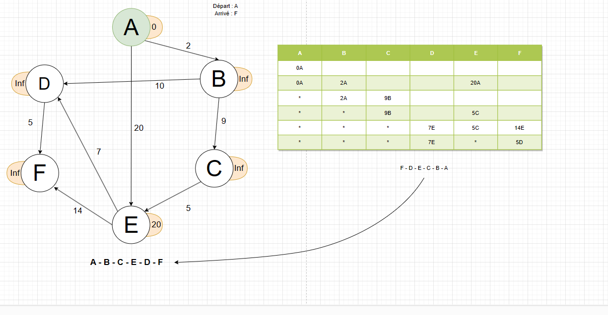

## Dijkstra algorith
Ceci est un projet d'entrainement et d'apprentissage de l'algorithme de Dijkstra
 
**Cahier des charges pour le développement d'un programme Python implémentant l'algorithme de Dijkstra :**

**Objectif :** Développer un programme interactif en Python permettant à l'utilisateur de trouver le chemin le plus court entre deux nœuds dans un graphe pondéré en utilisant l'algorithme de Dijkstra.

**Fonctionnalités :**

1. **Entrée du graphe :**
   - L'utilisateur peut choisir le nombre de sommet du graphe.
   - L'utilisateur peut soit choisir de donner les poids manuellement soit randomiser les valeurs.

2. **Sélection des nœuds de départ et d'arrivée :**
   - L'utilisateur peut choisir facilement les nœuds de départ et d'arrivée via une interface utilisateur.

3. **Fonctionnement de l'algorithme de Dijkstra**

    ###### On supose que le graph pondéré est déjà généré ou à été fourni par l'utilisateur. ici on se s'occupe uniquement de la partie algorithme de recherche de chemin optimal. 
    - > Préparation.
        - Selection du sommet de départ.
        - Selection du sommet d'arrivé.
        - Mise à jour du coup de chaque noeud (default is infinity).
        - Le coup du noeud de départ est initialisé à 0.
    - > Début de l'algorithme.
        - > Traitement du premier sommet.
            - Marquage du sommet pour signaler qu'il à déjà été traité.
            - Scan de tous les arcs sortant du sommet.
            - Mise à jour du coût des sommets adjacents.
        - > Traitement du sommet suivant (déterminé en fonction du coût. plus   petit coût en priorité).
            ##### _si le sommet à été traité on passe le sommet_
            - Marquage du sommet
            - Scan des arcs de sortie 
            - mise à jout du coût des sommets adjacents.

        Si le sommet ne possède pas d'arcs de sortie alors on arrête le process. 
        sinon on continue.

        
4. **Implémentation de l'algorithme de Dijkstra :**
    - > Liste des variables 
        - Un tableau matriciel 2D (matrice) avec les poids, en X le prédécesseur, en Y le successeur : Exemple du graphe ci-dessus.
  
        | A   | B   | C   | D   | E   | F   |
        | --- | --- | --- | --- | --- | --- |
        | 0   | 2   | 0   | 0   | 20  | 0   |
        | 0   | 0   | 9   | 0   | 0   | 0   |
        | 0   | 0   | 0   | 0   | 5   | 0   |
        | 0   | 0   | 0   | 0   | 0   | 5   |
        | 0   | 0   | 0   | 7   | 0   | 14  |
        | 0   | 0   | 0   | 0   | 0   | 0   |

        
    - > Un tableau en 2D qui servira de tableau de résolution (resolv_table)
  

        | A   | B   | C   | D   | E   | F   |
        | --- | --- | --- | --- | --- | --- |
        | 0A  |     |     |     |     |     |
        | 0A  | 2A  |     |     | 20A |     |
        |     | 2A  | 9B  |     |     |     |
        |     |     | 9B  |     | 5C  |     |
        |     |     |     | 7E  | 5C  | 14E |
        |     |     |     | 7E  |     | 5D  |

5. **Affichage des résultats :**
   - Les résultats, y compris le chemin le plus court et le coût total, sont affichés de manière claire et compréhensible à l'utilisateur.
   - En cas d'impossibilité d'atteindre le nœud cible à partir du nœud de départ, le programme informe l'utilisateur.

6. **Interface utilisateur interactive :**
   - Le programme dispose d'une interface utilisateur interactive avec des messages informatifs pour guider l'utilisateur tout au long du processus.
   - Des options conviviales, telles que des menus déroulants ou des champs de saisie, facilitent l'interaction.

7. **Gestion des erreurs et des exceptions :**
   - 

8. **Documentation complète :**
   - Le code est accompagné d'une documentation complète, expliquant le fonctionnement interne, les structures de données utilisées, et la manière d'interagir avec le programme.

9. **Tests unitaires et validation :**
   - Le programme intègre des tests unitaires pour garantir la fiabilité de l'implémentation de l'algorithme de Dijkstra dans différentes situations.
   - Des scénarios de validation sont inclus pour démontrer la robustesse du programme.

**Contraintes techniques :**
   - Utilisation exclusive du langage Python.
   - L'utilisation de bibliothèques tierces est autorisée uniquement si justifiée et bien documentée.

**Livraison :**
   - Fourniture du code source du programme.
   - Documentation détaillée comprenant des instructions d'utilisation, explications des choix d'implémentation, et tout autre détail pertinent.

**Échéance :**
   - La date limite de livraison sera définie en accord avec les exigences du projet et la complexité de l'implémentation.
